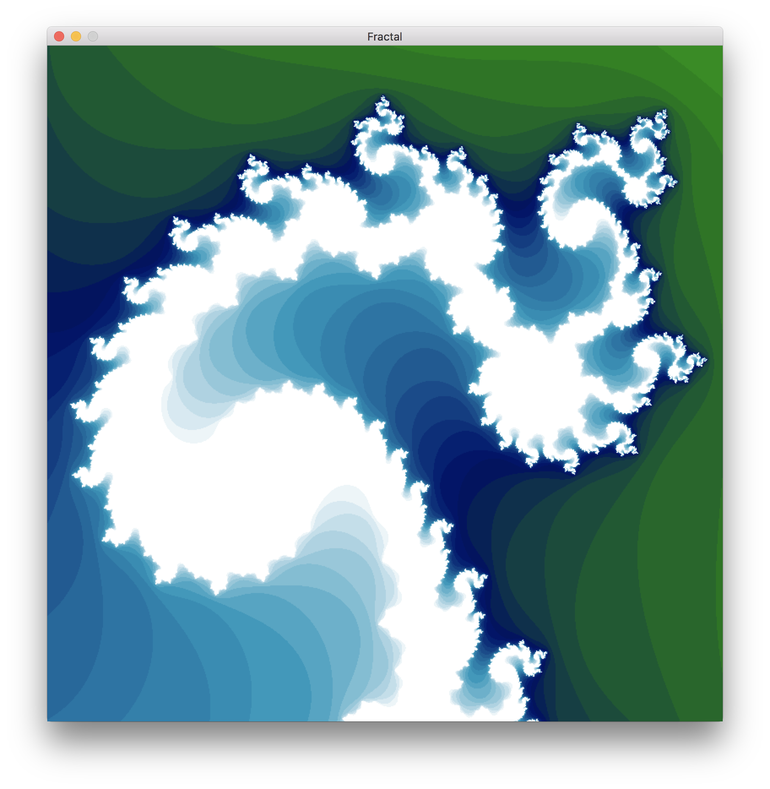

# fractal
An interactive Mandelbrot generator with a Numpy and Numba JIT backend.
The fractal is generated using either the Numpy based or the Numba based backend and rendered with Matplotlib and TKinter. The backend can be toggled during execution. The Numba JIT backend offers significant framerate gain over simply computing the image in Numpy, but both are available as this was mostly an excercize in testing the relative performance of these two methods. Numba is the default backend. As the zoom level is increased the iteration depth is dynamically adjusted.



<p float="left">
  
  
</p>
## Requirements
* Python3
* Numba
* Numpy
* Matplotlib

## Setup
`pip install -r requirements.txt`

## Usage
```
usage: fractal.py [-h] [-k {np,nb}] w h

Fractal Renderer

positional arguments:
  w
  h

optional arguments:
  -h, --help            show this help message and exit
  --kernel {np,nb}
  ```

* `Left Mouse` - Translate
* `Right Mouse` - Zoom
* <kbd>1234</kbd> - Change colors
* <kbd>R</kbd> - Reset view
* <kbd>-+</kbd> - Adjust iteration depth
* <kbd>T</kbd> - Toggle renderer backend
* <kdb>ESC</kbd> - Quit


